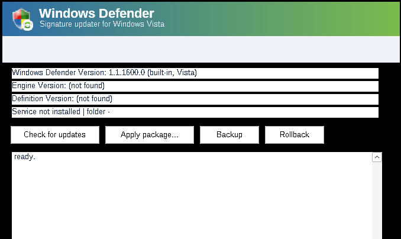

# WDUV — vista-defender-update v3


[](https://github.com/stelgen/WDUV/releases)
[](LICENSE)


**Fresh file signatures for the built-in Windows Defender of Windows Vista —
without touching its engine. Now with a Vista-styled GUI.**

The built-in Windows Defender of Windows Vista (app `1.1.1600.0`) kept
receiving engine and definition updates until the OS went out of support.
A fully updated installation carries engine `1.1.17020.2` and happily runs
definition generations years newer than the engine build (a stock system
shows `Definition Version 1.315.1121.0`, a ~2020 generation). WDUV v3:

1. downloads the **freshest definition package that has a chance to load**
   on the local engine (ranked source ladder),
2. unpacks it **in pure C** (PE → `.rsrc` → CAB → stored/LZX folders),
3. applies **only the antispyware signature files** (`mpasbase.vdm`,
   `mpasdlta.vdm`) the way Vista itself does — a fresh
   `Definition Updates\{GUID}` folder plus a registry pointer flip,
4. watches the service and **rolls back automatically** if the engine
   rejects the new definitions, then falls through to the next-older source.

The engine binary is **never replaced**. The tool is a single ~230 KB static
executable (CLI + GUI in one) whose PE header is natively stamped
`minOS 6.00` — no Go, no .NET, no VC runtime.

## GUI

`vdu gui` (or simply launch the exe) opens a window mimicking the stock
Windows Defender of the era — blue→green banner, shield, status pane, log.



## CLI

```
vdu status                       engine/definition versions, registry, folders
vdu sources                      the pinned source ladder
vdu fetch <name> [-out dir]      download + unpack a package (run on a modern PC)
vdu update [-source name]        download → apply → health-check → auto-rollback
vdu apply -package <pkg|dir>     apply extracted signatures (signatures-only)
vdu backup / rollback            safety net
vdu verify <name|file>           SHA-256 + structure + version report
vdu gui                          the window above
```

## The definition-generation matrix (measured 01.10.2026)

| source | package engine | mpas generation | notes |
|---|---|---|---|
| `current` (fwlink 121721) | 1.1.26080.3 | **1.459.497.0** | today's Win11-era package |
| `vista-x86-2019` (archive.org) | 1.2.1009.0 | 1.305.416.0 | frozen, tagged *for Windows Vista x86* |
| `win7-x86-2018` (archive.org) | 1.2.1009.0 | 1.283.1902.0 | Windows 7 era |
| `xp-2016` (archive.org) | 1.2.1003.0 | 1.225.2438.0 | April 2016 |

Your engine already runs generation **1.315** — the vdm format of its era
tolerates generations years newer than the engine build. Whether generation
459 still parses on `1.1.17020.2` is exactly the experiment `update`
performs safely (try → health-check → auto-rollback → next source).

**Why not convert the 2026 definitions into the 2015 format?** Both formats
are undocumented MMPC databases; a converter means reverse-engineering two
proprietary formats plus their integrity model, and the 2016 engine has no
code for a decade of new record types. Details in `docs/ANALYSIS.md`.

## Build & test

```bash
make test      # 13-test suite, runs anywhere gcc exists
make exe       # mingw cross-build: i386 + amd64, icon + version + manifest
```

Optional integration against real packages:

```bash
VDU_TEST_MPAM=mpam-fe.exe VDU_TEST_VISTA=mpam-fe_vista_x86.exe \
VDU_TEST_WIN7=mpam-fe-w7x86.exe make test   # byte-for-byte vs cabextract
```

## Branding note

The shield in `assets/` is the authentic Windows Defender icon extracted
from Windows Vista system resources (archive.org
`windows-vista-and-7-icons-and-resources`); it belongs to Microsoft and is
used here solely as an homage for this interoperability tool.

## Project layout

```
src/main.c            CLI entry
src/gui.c             Vista Defender-styled GUI (Win32, GDI)
src/ops.c             update/apply/backup/rollback shared by CLI and GUI
src/apply.c           GUID-flip apply, backup, rollback, health check
src/cab.c, src/lzx.c  CAB + LZX extractors (lzx.c = libmspack port, LGPL-2.1)
src/pe.c, src/sha256.c  PE parsing, versioninfo, hashing
src/platform_win.c    registry / service / WinHTTP / GUID
tests/                13-test suite + real-package integration
tools/                patchpe.py, icon_v3.py, versioninfo.rc, app.manifest
docs/                 ANALYSIS.md (measured matrix, RU), screenshot-gui.png
```

## License

MIT — except `src/lzx.c`, a port of
[libmspack](https://github.com/kyz/libmspack)'s `lzxd.c` (LGPL-2.1), and the
Defender shield artwork (© Microsoft, extracted from Windows Vista).

---

*WDUV = Windows Defender Update (Vista). v1 (Go) — tag `v1.0.0`; v2 (C CLI) —
tag `v2.0.0`; v3 adds the GUI, authentic branding and the screenshot story.*
